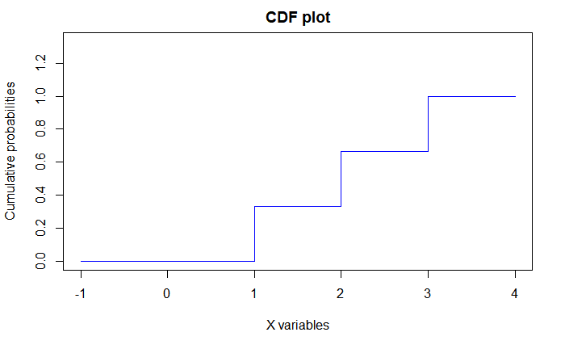
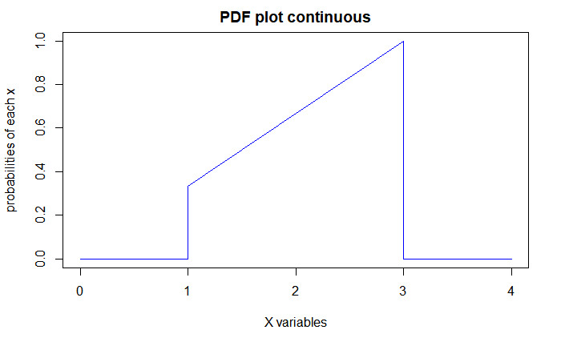

# packets

1. CDF function (discrete)
  
  - select x range : xrange <- 1:3
  - select coefficient : fun <- (1/3)
  - cdf_dis_function(1:3, (1/3))
  
  
  
2. PDF function (continuous)

  - select x range : xrange <- 1:3
  - select coefficient : fun <- (1/3)
  - pdf_con_function(1:3, (1/3))
  
